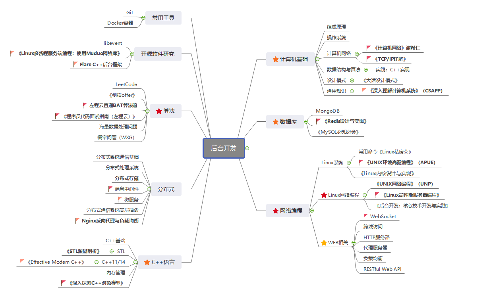

# 学习路线

## C++

### 参考书籍

- 《STL源码剖析》
- 《Effective Modern C++》
- 《深入探索C++对象模型》

## Network Programming

### 必看书

- **《UNIX环境高级编程 第三版》**（apue）
- 《UNIX网络编程 第三版》（unp）
- **《Linux高性能服务器编程》**
- 《Linux多线程服务端编程：使用muduo C++网络库》
- 《Linux内核设计与实现》

## DataBase

### 参考书

- 《MySQL必知必会》
- 《Redis设计与实现》

## 分布式

## 计算机基础

### 参考教材

- 408（数据结构、计算机网络、计算机组成原理、操作系统）

## 综合书籍

- 《深入理解计算机系统》（csapp）
- 《后台开发：核心技术与应用实践》

## 算法

- 《剑指offer》
- LeetCode刷题
- 左神的算法课和书